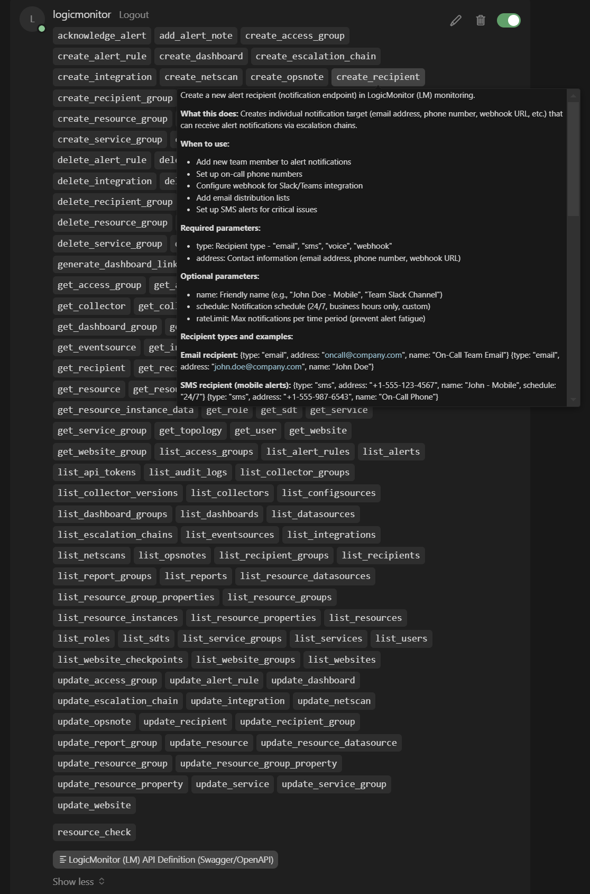
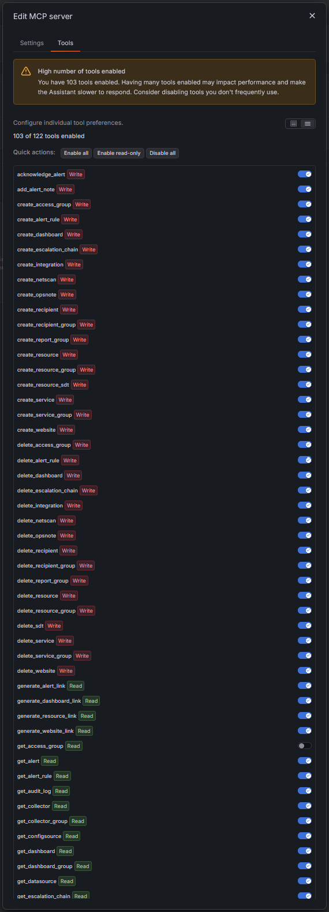
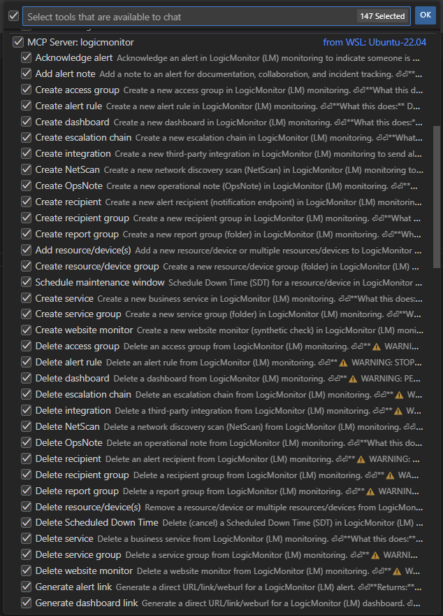

# LogicMonitor MCP Server

Model Context Protocol (MCP) server for LogicMonitor - enables AI assistants to interact with your LogicMonitor.

[](https://github.com/monitoringartist/logicmonitor-mcp-server/actions)
[](https://github.com/monitoringartist/logicmonitor-mcp-server/releases)
[](https://www.npmjs.com/package/logicmonitor-mcp-server)
[](LICENSE)
[](https://www.typescriptlang.org/)
[](https://nodejs.org/)

> [!IMPORTANT]
> 
> 🛠️ **Managed & Supported by [Monitoring Artist](https://www.monitoringartist.com)**
>
> This MCP server is an independent, community-driven innovation by Monitoring Artist.
>
> **Official Support Disclaimer:** This project is not an official LogicMonitor product and is not covered by LogicMonitor’s standard support tiers.
> 
> **Need Enterprise-Grade Reliability?** > Monitoring Artist provides professional implementation, custom feature development, and dedicated support for this integration. [Partner with us for expert solutions](https://www.monitoringartist.com).

## Features

- **352 MCP Tools** for comprehensive LogicMonitor operations (177 read-only, 175 write) — **100% LogicMonitor API v3 coverage**
- **Unified Server**: Single server implementation supporting all transport modes (STDIO, SSE, HTTP)
- **Multiple Transport Modes**: STDIO for local use, SSE/HTTP for remote access
- **Flexible Authentication**: No auth (dev), bearer token, or OAuth/OIDC
- **CSRF Protection**: Automatic CSRF protection for session-based authentication
- **Read-Only Mode**: Safe monitoring without modification capabilities (enabled by default)
- **Strict `fields` Validation**: Field selectors on canonical list/get tools are validated against the LogicMonitor Swagger v3 spec, so a typo'd field name returns a clear error with suggestions instead of being silently dropped
- **Flexible Configuration**: CLI flags, environment variables, or `.env` file
- **Debug Logging**: JSON or human-readable formats with detailed request/response logging
- **Tool Filtering**: Enable specific tools or disable search functionality
- **Rate Limiting**: Automatic retry with exponential backoff
- **Batch Operations**: Process multiple resources efficiently
- **Smart Batching**: Adaptive concurrency that automatically adjusts to API rate limits
- **TLS/HTTPS Support**: Optional TLS for secure remote access

## Images

### Cursor Prompt - Resource Check Demo

*High‑level demonstration of using the LogicMonitor MCP server in Cursor, showing how to execute a
LogicMonitor resource check using an MCP prompt with the argument "www.google.com" (a resource in LogicMonitor).
The agent has knowledge about available MCP tools and uses them in a self‑correcting way:*


### Cursor Tools

*Screenshot showing the available LogicMonitor MCP tools within Cursor:*



### Grafana Assistant Tools

*Screenshot showing the available LogicMonitor MCP tools within Grafana Assistant:*



### VS Code Tools

*Screenshot showing the available LogicMonitor MCP tools within Visual Studio Code:*



## Installation Options

### Local LogicMonitor MCP server

Run LogicMonitor MCP Server locally with STDIO transport for Claude Desktop:

[](https://insiders.vscode.dev/redirect/mcp/install?name=company.logicmonitor.com&inputs=%5B%7B%22id%22%3A%22lm_company%22%2C%22type%22%3A%22promptString%22%2C%22description%22%3A%22LogicMonitor%20company%2Faccount%20name%20(subdomain)%22%2C%22password%22%3Afalse%7D%2C%7B%22id%22%3A%22lm_bearer_token%22%2C%22type%22%3A%22promptString%22%2C%22description%22%3A%22LogicMonitor%20API%20Bearer%20Token%22%2C%22password%22%3Atrue%7D%5D&config=%7B%22command%22%3A%22docker%22%2C%22args%22%3A%5B%22run%22%2C%22-i%22%2C%22--rm%22%2C%22-e%22%2C%22LM_COMPANY%22%2C%22-e%22%2C%22LM_BEARER_TOKEN%22%2C%22ghcr.io%2Fmonitoringartist%2Flogicmonitor-mcp-server%22%5D%2C%22env%22%3A%7B%22LM_COMPANY%22%3A%22%24%7Binput%3Alm_company%7D%22%2C%22LM_BEARER_TOKEN%22%3A%22%24%7Binput%3Alm_bearer_token%7D%22%7D%7D)
[](https://insiders.vscode.dev/redirect/mcp/install?name=company.logicmonitor.com&inputs=%5B%7B%22id%22%3A%22lm_company%22%2C%22type%22%3A%22promptString%22%2C%22description%22%3A%22LogicMonitor%20company%2Faccount%20name%20(subdomain)%22%2C%22password%22%3Afalse%7D%2C%7B%22id%22%3A%22lm_bearer_token%22%2C%22type%22%3A%22promptString%22%2C%22description%22%3A%22LogicMonitor%20API%20Bearer%20Token%22%2C%22password%22%3Atrue%7D%5D&config=%7B%22command%22%3A%22npx%22%2C%22args%22%3A%5B%22-y%22%2C%22logicmonitor-mcp-server%22%5D%2C%22env%22%3A%7B%22LM_COMPANY%22%3A%22%24%7Binput%3Alm_company%7D%22%2C%22LM_BEARER_TOKEN%22%3A%22%24%7Binput%3Alm_bearer_token%7D%22%7D%7D)
[](https://insiders.vscode.dev/redirect/mcp/install?name=company.logicmonitor.com&inputs=%5B%7B%22id%22%3A%22lm_company%22%2C%22type%22%3A%22promptString%22%2C%22description%22%3A%22LogicMonitor%20company%2Faccount%20name%20(subdomain)%22%2C%22password%22%3Afalse%7D%2C%7B%22id%22%3A%22lm_bearer_token%22%2C%22type%22%3A%22promptString%22%2C%22description%22%3A%22LogicMonitor%20API%20Bearer%20Token%22%2C%22password%22%3Atrue%7D%5D&config=%7B%22command%22%3A%22wsl.exe%22%2C%22args%22%3A%5B%22docker%22%2C%22run%22%2C%22-i%22%2C%22--rm%22%2C%22-e%22%2C%22LM_COMPANY%22%2C%22-e%22%2C%22LM_BEARER_TOKEN%22%2C%22ghcr.io%2Fmonitoringartist%2Flogicmonitor-mcp-server%22%5D%2C%22env%22%3A%7B%22LM_COMPANY%22%3A%22%24%7Binput%3Alm_company%7D%22%2C%22LM_BEARER_TOKEN%22%3A%22%24%7Binput%3Alm_bearer_token%7D%22%2C%22WSLENV%22%3A%22LM_COMPANY%3ALM_BEARER_TOKEN%22%7D%7D)
[](https://insiders.vscode.dev/redirect/mcp/install?name=company.logicmonitor.com&inputs=%5B%7B%22id%22%3A%22lm_company%22%2C%22type%22%3A%22promptString%22%2C%22description%22%3A%22LogicMonitor%20company%2Faccount%20name%20(subdomain)%22%2C%22password%22%3Afalse%7D%2C%7B%22id%22%3A%22lm_bearer_token%22%2C%22type%22%3A%22promptString%22%2C%22description%22%3A%22LogicMonitor%20API%20Bearer%20Token%22%2C%22password%22%3Atrue%7D%5D&config=%7B%22command%22%3A%22wsl.exe%22%2C%22args%22%3A%5B%22npx%22%2C%22-y%22%2C%22logicmonitor-mcp-server%22%5D%2C%22env%22%3A%7B%22LM_COMPANY%22%3A%22%24%7Binput%3Alm_company%7D%22%2C%22LM_BEARER_TOKEN%22%3A%22%24%7Binput%3Alm_bearer_token%7D%22%2C%22WSLENV%22%3A%22LM_COMPANY%3ALM_BEARER_TOKEN%22%7D%7D)
[](cursor://anysphere.cursor-deeplink/mcp/install?name=company.logicmonitor.com&config=eyJlbnYiOnsiTE1fQ09NUEFOWSI6InlvdXItbG0tY29tcGFueSIsIkxNX0JFQVJFUl9UT0tFTiI6InlvdXItbG0tYmVhcmVyLXRva2VuIn0sImNvbW1hbmQiOiJkb2NrZXIgcnVuIC1pIC0tcm0gLWUgTE1fQ09NUEFOWSAtZSBMTV9CRUFSRVJfVE9LRU4gZ2hjci5pby9tb25pdG9yaW5nYXJ0aXN0L2xvZ2ljbW9uaXRvci1tY3Atc2VydmVyIn0%3D)
[](cursor://anysphere.cursor-deeplink/mcp/install?name=company.logicmonitor.com&config=eyJlbnYiOnsiTE1fQ09NUEFOWSI6InlvdXItbG0tY29tcGFueSIsIkxNX0JFQVJFUl9UT0tFTiI6InlvdXItbG0tYmVhcmVyLXRva2VuIn0sImNvbW1hbmQiOiJucHggLXkgbG9naWNtb25pdG9yLW1jcC1zZXJ2ZXIifQ%3D%3D)
[](cursor://anysphere.cursor-deeplink/mcp/install?name=company.logicmonitor.com&config=eyJlbnYiOnsiTE1fQ09NUEFOWSI6InlvdXItbG0tY29tcGFueSIsIkxNX0JFQVJFUl9UT0tFTiI6InlvdXItbG0tYmVhcmVyLXRva2VuIiwiV1NMRU5WIjoiTE1fQ09NUEFOWTpMTV9CRUFSRVJfVE9LRU4ifSwiY29tbWFuZCI6IndzbC5leGUgZG9ja2VyIHJ1biAtaSAtLXJtIC1lIExNX0NPTVBBTlkgLWUgTE1fQkVBUkVSX1RPS0VOIGdoY3IuaW8vbW9uaXRvcmluZ2FydGlzdC9sb2dpY21vbml0b3ItbWNwLXNlcnZlciJ9)
[](cursor://anysphere.cursor-deeplink/mcp/install?name=company.logicmonitor.com&config=eyJlbnYiOnsiTE1fQ09NUEFOWSI6InlvdXItbG0tY29tcGFueSIsIkxNX0JFQVJFUl9UT0tFTiI6InlvdXItbG0tYmVhcmVyLXRva2VuIiwiV1NMRU5WIjoiTE1fQ09NUEFOWTpMTV9CRUFSRVJfVE9LRU4ifSwiY29tbWFuZCI6IndzbC5leGUgbnB4IC15IGxvZ2ljbW9uaXRvci1tY3Atc2VydmVyIn0%3D)
[](https://www.npmjs.com/package/logicmonitor-mcp-server)
[](https://claude.ai/download)

```bash
# Quick start with npx (no installation needed)
npx logicmonitor-mcp-server

# Or install globally
npm install -g logicmonitor-mcp-server
logicmonitor-mcp-server
```

**Add to Claude Desktop** (`~/Library/Application Support/Claude/claude_desktop_config.json` on macOS):

```json
{
  "mcpServers": {
    "logicmonitor": {
      "command": "npx",
      "args": ["-y", "logicmonitor-mcp-server"],
      "env": {
        "LM_COMPANY": "mycompany",
        "LM_BEARER_TOKEN": "your-bearer-token-here"
      },
      "type": "stdio"
    }
  }
}
```

**Best for**: Personal use, Claude Desktop integration, local development


### Example Remote LogicMonitor MCP server

Run LogicMonitor MCP Server remotely with SSE or HTTP transport for web-based access:

[](https://insiders.vscode.dev/redirect/mcp/install?name=company.logicmonitor.com&config=%7B%22url%22%3A%22http%3A%2F%2Flocalhost%3A3000%2Fmcp%22%2C%22transport%22%3A%22http%22%7D)


```bash
# Quick start with Docker
docker run -d -p 3000:3000 \
  -e LM_COMPANY=mycompany \
  -e LM_BEARER_TOKEN=your-token \
  -e MCP_TRANSPORT=streamable-http \
  -e OAUTH_PROVIDER=none \
  monitoringartist/logicmonitor-mcp-server

# Available container images

| Registry | Pull command | Notes |
| --- | --- | --- |
| GitHub Container Registry | `docker pull ghcr.io/monitoringartist/logicmonitor-mcp-server:<tag>` | Tags include `latest`, `vX.Y.Z`, `X.Y`, and `X`. |
| Docker Hub | `docker pull monitoringartist/logicmonitor-mcp-server:<tag>` | Mirrors the same tags as GHCR. |

# Or use Docker Compose for production
curl -o docker-compose.yml https://raw.githubusercontent.com/monitoringartist/logicmonitor-mcp-server/main/docker-compose.yml
cp env.example .env  # Configure your credentials
docker-compose up -d logicmonitor-mcp-http
```

**Best for**: Web applications, remote access, multiple users, enterprise deployments, where admin controls access.

## Quick Start

### Prerequisites

- Node.js >= 18 (or Docker)
- LogicMonitor account with API access
- LogicMonitor API Bearer Token

### Installation

#### Option A: Node.js

```bash
# Clone the repository
git clone https://github.com/monitoringartist/logicmonitor-mcp-server.git
cd logicmonitor-mcp-server

# Install dependencies
npm install

# Build the project
npm run build
```

#### Option B: Docker

```bash
# Clone the repository
git clone https://github.com/monitoringartist/logicmonitor-mcp-server.git
cd logicmonitor-mcp-server

# Build Docker image
docker build -t logicmonitor-mcp-server .

# Or use Docker Compose
cp env.example .env
# Edit .env with your credentials
docker-compose up -d logicmonitor-mcp-http
```

### Configuration

Choose one of three methods to configure (listed in order of precedence):

#### Option 1: Environment Variables (Recommended)

```bash
export LM_COMPANY=mycompany
export LM_BEARER_TOKEN=your-bearer-token-here
npm start
```

#### Option 2: `.env` File

```bash
# Copy the example file
cp env.example .env

# Edit .env with your credentials
nano .env

# Run the server
npm start
```

#### Option 3: CLI Flags

```bash
npm start -- --lm-company mycompany --lm-bearer-token "your-token"
```

## CLI Reference

### Transport Options

| Flag | Environment Variable | Default | Description |
|------|---------------------|---------|-------------|
| `-t, --transport <type>` | `MCP_TRANSPORT` | `stdio` | Transport type: `stdio`, `sse`, or `streamable-http` |
| `--address <host:port>` | `MCP_ADDRESS` | `localhost:3000` | Server address for SSE/HTTP transports |
| `--base-path <path>` | `MCP_BASE_PATH` | - | Base path for the server |
| `--endpoint-path <path>` | `MCP_ENDPOINT_PATH` | `/mcp` | Endpoint path for streamable-http |

### TLS Configuration (streamable-http transport only)

| Flag | Environment Variable | Default | Description |
|------|---------------------|---------|-------------|
| `--server.tls-cert-file <path>` | `MCP_TLS_CERT_FILE` | - | Path to TLS certificate file for HTTPS. Server uses HTTPS if both cert and key are configured |
| `--server.tls-key-file <path>` | `MCP_TLS_KEY_FILE` | - | Path to TLS private key file for HTTPS. Both cert and key required for HTTPS |

**Note:** By default (when TLS is not configured), the server listens on HTTP protocol. When both certificate and key files are provided, the server automatically switches to HTTPS protocol only.

### Debug and Logging

| Flag | Environment Variable | Default | Description |
|------|---------------------|---------|-------------|
| `--debug` | `MCP_DEBUG=true` | `false` | Enable debug mode with detailed logging |
| `--log-format <format>` | `MCP_LOG_FORMAT` | `human` | Log format: `json` or `human` |
| `--log-level <level>` | `MCP_LOG_LEVEL` | `info` | Log level: `debug`, `info`, `warn`, or `error` |

### Tool Configuration

| Flag | Environment Variable | Default | Description |
|------|---------------------|---------|-------------|
| `--enabled-tools <list>` | `MCP_ENABLED_TOOLS` | all | Comma-separated list of enabled tools |
| `--read-only` | `MCP_READ_ONLY` | `true` | Enable only read-only tools (safer). Set `MCP_READ_ONLY=false` to enable write operations |
| `--collapse-tools-level-1` | `MCP_COLLAPSE_TOOLS_LEVEL_1` | `false` | Collapse per-verb CRUD tools (`list_`/`get_`/`create_`/`update_`/`delete_`/`import_`) into single `manage_<resource>` tools that take an `operation` parameter. Reduces the advertised tool count so large tool sets are easier for AI agents. Honors read-only mode (write operations are rejected at call time) |
| `--collapse-tools-level-2` | `MCP_COLLAPSE_TOOLS_LEVEL_2` | `false` | Additionally fold leaf tools (sub-collection reads, data/graph/history endpoints, and actions such as `acknowledge_*`) into the matching parent `manage_<resource>` tool as extra `<verb>_<remainder>` operations, reducing the tool count further. Requires `--collapse-tools-level-1` |

#### Tool Count Reduction

Collapsing reduces the number of advertised tools, which makes large tool sets easier for AI agents to select from. Approximate counts:

| Mode | Base | Level 1 | Level 2 |
|------|-----:|--------:|--------:|
| Full (read-write) | 352 | 144 | 92 |
| Read-only | 177 | 124 | 80 |

> Level 2 is additive on top of level 1 and requires it to be enabled. No tool functionality is lost when collapsing: the original operations remain available through the consolidated `manage_<resource>` tools via the `operation` parameter.

### LogicMonitor API (Required)

| Flag | Environment Variable | Description |
|------|---------------------|-------------|
| `--lm-company <name>` | `LM_COMPANY` | Your LogicMonitor company/account name (subdomain). Example: if your portal is `mycompany.logicmonitor.com`, use `mycompany` |
| `--lm-bearer-token <token>` | `LM_BEARER_TOKEN` | LogicMonitor API Bearer Token. Generate at: Settings > Users & Roles > API Tokens |

### MCP Server Authentication (Optional - for SSE/HTTP transports only)

| Flag | Environment Variable | Default | Description |
|------|---------------------|---------|-------------|
| `--mcp-bearer-token <token>` | `MCP_BEARER_TOKEN` | - | Static bearer token for authenticating clients connecting to the MCP server. Used as an alternative or supplement to OAuth for remote access via SSE/HTTP transports. Not required for STDIO transport. |
| - | `OAUTH_PROVIDER` | `none` | OAuth provider type: `none` (disabled), `github`, `google`, `azure`, `okta`, `auth0`, or `custom`. Set to `none` or leave unset to disable OAuth authentication. |

**Note:** This is for authenticating **to** the MCP server, not for LogicMonitor API access.

**Authentication Modes:**
- **No Authentication** (default): If neither `MCP_BEARER_TOKEN` nor OAuth is configured (`OAUTH_PROVIDER=none`), unauthenticated access is allowed. Suitable for development/testing only.
- **Bearer Token**: Simple static token authentication - set `MCP_BEARER_TOKEN`
- **OAuth/OIDC**: Enterprise authentication - configure `OAUTH_PROVIDER` and related settings (see [env.example](env.example))
- **Both**: Both authentication methods can work simultaneously

## Usage Examples

### Claude Desktop (STDIO - Recommended)

Add to your Claude Desktop configuration (`~/Library/Application Support/Claude/claude_desktop_config.json` on macOS):

```json
{
  "mcpServers": {
    "logicmonitor": {
      "command": "node",
      "args": [
        "/path/to/logicmonitor-mcp-server/build/servers/index.js"
      ],
      "env": {
        "LM_COMPANY": "mycompany",
        "LM_BEARER_TOKEN": "your-bearer-token",
        "MCP_TRANSPORT": "stdio"
      }
    }
  }
}
```

**Note:** The `MCP_TRANSPORT=stdio` is optional as it's the default, but included for clarity.

### SSE Transport (Remote Access)

```bash
# Start SSE server with debug logging
npm start -- --transport sse --address localhost:3000 --debug

# Or using environment variables
export MCP_TRANSPORT=sse
export MCP_ADDRESS=localhost:3000
export MCP_DEBUG=true
npm start

# Or use the convenience script
npm run start:sse
```

**Note:** For SSE/HTTP transports, authentication is optional but recommended:
- **Development/Testing**: No authentication required (default with `OAUTH_PROVIDER=none`)
- **Production**: Configure `MCP_BEARER_TOKEN` or OAuth (see Authentication Modes below)

**Health Check Endpoints:** When using SSE or streamable HTTP transports, health check endpoints are available:

#### Simple Health Check (`/healthz`)
```bash
# Quick health check
curl http://localhost:3000/healthz
# Response: 200 OK with body "ok"
```

#### Detailed Health Check (`/health`)
```bash
# Detailed health information
curl http://localhost:3000/health
```

Response includes:
```json
{
  "status": "healthy",
  "version": "1.0.0",
  "uptime": 3600.5,
  "memory": {
    "rss": 52428800,
    "heapTotal": 20971520,
    "heapUsed": 15728640,
    "external": 1048576,
    "arrayBuffers": 262144
  },
  "connections": {
    "mcp": 5,
    "http": 3
  },
  "timestamp": "2025-11-02T12:00:00.000Z",
  "transport": {
    "mode": "both",
    "http": true,
    "sse": true
  }
}
```

These endpoints can be used by:
- Load balancers (use `/healthz` for simple checks)
- Monitoring systems (use `/health` for detailed metrics)
- Orchestration platforms (Docker, Kubernetes)
- CI/CD health checks
- APM and observability tools

**Note:** Health check endpoints are not available when using the STDIO transport.

### HTTPS/TLS Configuration (Secure Transport)

To enable HTTPS for the SSE or streamable HTTP transport, provide both certificate and key files:

```bash
# Using environment variables (recommended)
export MCP_TLS_CERT_FILE=/path/to/cert.pem
export MCP_TLS_KEY_FILE=/path/to/key.pem
export MCP_TRANSPORT=sse
npm start

# Using CLI flags
npm start -- --transport sse \
  --server.tls-cert-file /path/to/cert.pem \
  --server.tls-key-file /path/to/key.pem

# Access via HTTPS
curl https://localhost:3000/healthz
```

**Behavior:**
- **TLS Not Configured** (default): Server uses HTTP protocol
- **TLS Configured** (both cert and key files provided): Server uses HTTPS protocol only
- **Partial TLS Config** (only cert OR only key): Server uses HTTP protocol (both required)

**Generate Self-Signed Certificate for Testing:**

```bash
# Generate self-signed certificate (for development/testing only)
openssl req -x509 -newkey rsa:4096 -keyout key.pem -out cert.pem -days 365 -nodes \
  -subj "/CN=localhost"

# Start server with TLS
npm start -- --transport sse \
  --server.tls-cert-file ./cert.pem \
  --server.tls-key-file ./key.pem
```

**Production Recommendations:**
- Use certificates from a trusted Certificate Authority (Let's Encrypt, commercial CAs)
- Consider using a reverse proxy (nginx, Caddy) for TLS termination
- Rotate certificates before expiry
- Use strong TLS protocols (TLS 1.2+)

### Read-Only Mode (Default - Safe Monitoring)

By default, the server runs in read-only mode for safety:

```bash
# Read-only mode (default)
npm start

# Explicitly enable write operations
npm start -- # with MCP_READ_ONLY=false in .env

# Or via environment
export MCP_READ_ONLY=false
npm start
```

### Custom Tool Selection

```bash
# Enable specific tools only
npm start -- --enabled-tools "list_resources,get_resource,list_alerts,get_alert"
```

### JSON Logging for Production

```bash
npm start -- --log-format json --log-level warn
```

### Complete Example

```bash
npm start -- \
  --lm-company mycompany \
  --lm-bearer-token "your-token" \
  --transport sse \
  --address 0.0.0.0:8080 \
  --read-only \
  --log-format json \
  --log-level info
```

### Transport Mode Shortcuts

The unified server supports convenient npm scripts for each transport:

```bash
# STDIO transport (default, for Claude Desktop)
npm start
npm run start:stdio

# SSE transport (for web/remote clients)
npm run start:sse

# HTTP transport (for advanced integrations)
npm run start:http
```

## Available Tools

The server provides 352 tools for comprehensive LogicMonitor operations (100% LogicMonitor API v3 coverage). Tools are categorized by functionality and marked as **read-only** (safe) or **write** (modifies data).

### Resource/Device Management

**Read-Only:**
- `link_resource` - Generate direct link to device in LM UI
- `get_resource` - Get detailed device information by ID
- `list_resources` - List all monitored resources/devices with filtering (supports simple search via `query` parameter or advanced filtering via `filter` parameter)

**Write Operations:**
- `create_resource` - Add new device(s) to monitoring (supports batch)
- `delete_resource` - Remove device(s) from monitoring (supports batch)
- `update_resource` - Modify existing device(s) (supports batch)

### Resource/Device Groups

**Read-Only:**
- `get_resource_group` - Get device group details by ID
- `list_resource_groups` - List all device groups/folders

**Write Operations:**
- `create_resource_group` - Create new device group
- `delete_resource_group` - Delete device group
- `update_resource_group` - Modify device group

### Alert Management

**Read-Only:**
- `link_alert` - Generate direct link to alert in LM UI
- `get_action_chain` - Get action chain details
- `get_action_rule` - Get action rule details
- `get_alert` - Get detailed alert information
- `get_alert_rule` - Get alert rule details
- `list_action_chains` - List notification/escalation action chains
- `list_action_rules` - List alert action rules (route alerts to chains)
- `list_alert_rules` - List alert routing rules
- `list_alerts` - List active alerts with filtering (supports simple search via `query` parameter or advanced filtering via `filter` parameter)

**Write Operations:**
- `acknowledge_alert` - Acknowledge alert (stops escalation)
- `add_alert_note` - Add note to alert for documentation
- `create_action_chain` - Create a notification/escalation action chain
- `create_action_rule` - Create an alert action rule
- `create_alert_rule` - Create new alert routing rule
- `delete_action_chain` - Delete an action chain
- `delete_action_rule` - Delete an action rule
- `delete_alert_rule` - Delete alert rule
- `set_action_rule_status` - Enable or disable an action rule
- `update_action_chain` - Modify an action chain
- `update_action_rule` - Modify an action rule
- `update_alert_rule` - Modify alert rule

### DataSources & Monitoring

**Read-Only:**
- `fetch_instances_data` - Bulk-fetch metric data for multiple instances
- `get_configsource` - Get configsource details
- `get_datasource` - Get datasource details
- `get_datasource_overview_graph` - Get an overview graph definition
- `get_eventsource` - Get eventsource details
- `get_instance_alert_conf` - Get an instance alert setting
- `get_instance_graph_data` - Get rendered graph data for an instance
- `get_instance_graph_data_by_id` - Get graph data by instance ID + graph ID
- `get_instance_group_overview_graph_data` - Get instance group overview graph data
- `get_instance_sdt_history` - Get an instance's SDT history
- `get_logsource` - Get LogSource details
- `get_property_rule` - Get PropertySource details
- `get_resource_datasource` - Get device datasource details
- `get_resource_datasource_data` - Get aggregated datasource data across instances
- `get_resource_datasource_sdt_history` - Get a datasource's SDT history
- `get_resource_instance_config` - Get a specific collected config (with content)
- `get_resource_instance_data` - Get time-series metrics data
- `get_resource_instance_group` - Get instance group details
- `get_resource_sdt_history` - Get a device's SDT history
- `get_resource_top_talkers_graph` - Get NetFlow top-talkers graph data
- `get_resources_delta` - Fetch device changes since a delta snapshot
- `get_resources_delta_id` - Start a device delta-tracking session
- `list_configsources` - List configuration sources
- `list_datasource_devices` - List devices a datasource is applied to
- `list_datasource_overview_graphs` - List a datasource's overview graphs
- `list_datasource_update_reasons` - List a datasource's change/audit history
- `list_datasources` - List all available datasources
- `list_eventsources` - List all eventsources
- `list_instance_alert_confs` - List a specific instance's alert settings
- `list_logsources` - List LogSources (LM Logs collection rules)
- `list_property_rules` - List PropertySources (auto property assignment rules)
- `list_resource_alert_confs` - List a device's instance alert settings
- `list_resource_alerts` - List alerts for a specific device
- `list_resource_datasources` - List datasources applied to device
- `list_resource_eventsources` - List eventsources applied to a device
- `list_resource_instance_configs` - List collected ConfigSource configs for an instance
- `list_resource_instance_groups` - List datasource instance groups
- `list_resource_instances` - List datasource instances (disks, interfaces, etc.)
- `list_resource_netflow_endpoints` - List NetFlow traffic by endpoint
- `list_resource_netflow_flows` - List NetFlow traffic flows
- `list_resource_netflow_ports` - List NetFlow traffic by port

**Write Operations:**
- `create_configsource` - Create a new ConfigSource
- `create_datasource` - Create a new DataSource (LogicModule)
- `create_eventsource` - Create a new EventSource
- `create_logsource` - Create a new LogSource
- `create_property_rule` - Create a new PropertySource
- `delete_configsource` - Delete a ConfigSource
- `delete_datasource` - Delete a DataSource
- `delete_eventsource` - Delete an EventSource
- `delete_logsource` - Delete a LogSource
- `delete_property_rule` - Delete a PropertySource
- `import_configsource` - Import a ConfigSource from a JSON/XML definition
- `import_datasource` - Import a DataSource from XML/JSON
- `import_eventsource` - Import an EventSource from a JSON/XML definition
- `import_logsource` - Import a LogSource from a JSON definition
- `import_property_rule` - Import a PropertySource from a JSON definition
- `update_configsource` - Modify a ConfigSource
- `update_datasource` - Modify a DataSource
- `update_eventsource` - Modify an EventSource
- `update_logsource` - Modify a LogSource
- `update_property_rule` - Modify a PropertySource
- `update_resource_datasource` - Modify device datasource configuration

### Dashboards & Reporting

**Read-Only:**
- `clone_dashboard_group` - Clone a dashboard group (optionally recursive)
- `create_dashboard_group` - Create a dashboard group
- `delete_dashboard_group` - Delete a dashboard group
- `link_dashboard` - Generate direct link to dashboard in LM UI
- `get_dashboard` - Get dashboard details
- `get_dashboard_group` - Get dashboard group details
- `get_report` - Get report details
- `get_report_group` - Get report group details
- `get_widget` - Get widget configuration details
- `get_widget_data` - Get a widget's rendered data (optionally for a time range)
- `list_dashboard_groups` - List dashboard groups
- `list_dashboard_widgets` - List widgets belonging to a specific dashboard
- `list_dashboards` - List all dashboards
- `list_report_groups` - List report groups
- `list_reports` - List all reports
- `list_widgets` - List dashboard widgets across all dashboards
- `update_dashboard_group` - Update a dashboard group

**Write Operations:**
- `create_dashboard` - Create new dashboard
- `create_report` - Create a new report
- `create_report_group` - Create report group
- `create_widget` - Add a widget to a dashboard
- `delete_dashboard` - Delete dashboard
- `delete_report` - Delete a report
- `delete_report_group` - Delete report group
- `delete_widget` - Delete a widget
- `generate_report` - Run a report on demand (async; returns taskId)
- `get_report_task_result` - Get the status/output of an on-demand report run
- `update_dashboard` - Modify dashboard
- `update_report` - Modify a report
- `update_report_group` - Modify report group
- `update_widget` - Modify a widget

### Collectors & Infrastructure

**Read-Only:**
- `get_collector` - Get collector details
- `get_collector_agent_log_level` - Get a collector component's log level
- `get_collector_events` - Get recent events for a collector
- `get_collector_group` - Get collector group details by ID
- `get_collector_installer` - Get the installer download URL for a collector
- `get_collector_status_check` - Run a status check on a collector's services
- `get_netscan` - Get NetScan details
- `get_topology` - Get network topology information
- `list_collector_agent_log_levels` - List a collector's per-component log levels
- `list_collector_groups` - List collector groups
- `list_collector_versions` - List available collector versions
- `list_collectors` - List monitoring collectors (agents)
- `list_netscans` - List network discovery scans

**Write Operations:**
- `acknowledge_collector_down_alert` - Acknowledge a collector-down alert
- `create_collector` - Register a new collector
- `create_collector_group` - Create a collector group
- `create_netscan` - Create NetScan
- `delete_collector` - Delete a collector
- `delete_collector_group` - Delete a collector group
- `delete_netscan` - Delete netscan
- `execute_debug_command` - Run a debug command on a collector (async; returns sessionId)
- `get_debug_command_result` - Get the output of a collector debug command
- `update_collector` - Modify collector settings
- `update_collector_agent_log_level` - Set a collector component's log level
- `update_collector_group` - Update a collector group
- `update_netscan` - Modify NetScan

### Website Monitoring

**Read-Only:**
- `create_website_group` - Create a website group
- `delete_website_group` - Delete a website group (optionally with children)
- `link_website` - Generate direct link to website in LM UI
- `get_website` - Get website monitor details
- `get_website_checkpoint_data` - Get raw monitoring data for a website checkpoint
- `get_website_graph_data` - Get rendered graph data for a website checkpoint
- `get_website_group` - Get website group details
- `get_website_group_sdt_history` - Get SDT history for a website group
- `list_website_checkpoints` - List available monitoring checkpoints
- `list_website_group_sdts` - List active SDTs on a website group
- `list_website_group_websites` - List website monitors in a group
- `list_website_groups` - List website groups
- `list_websites` - List website monitors
- `update_website_group` - Update a website group

**Write Operations:**
- `create_website` - Create new website monitor
- `delete_website` - Delete website monitor
- `update_website` - Modify website monitor

### Services (Business Logic)

**Read-Only:**
- `get_service` - Get service details
- `get_service_group` - Get service group details
- `list_service_groups` - List service groups
- `list_services` - List business services

**Write Operations:**
- `create_service` - Create new business service
- `create_service_group` - Create service group
- `delete_service` - Delete service
- `delete_service_group` - Delete service group
- `update_service` - Modify service
- `update_service_group` - Modify service group

### Alert Configuration

**Read-Only:**
- `get_escalation_chain` - Get escalation chain details
- `get_recipient_group` - Get recipient group details
- `list_escalation_chains` - List alert escalation chains
- `list_recipient_groups` - List recipient groups

**Write Operations:**
- `create_escalation_chain` - Create escalation chain
- `create_recipient_group` - Create recipient group
- `delete_escalation_chain` - Delete escalation chain
- `delete_recipient_group` - Delete recipient group
- `update_escalation_chain` - Modify escalation chain
- `update_recipient_group` - Modify recipient group

### Integrations

**Read-Only:**
- `get_integration` - Get integration details
- `list_integrations` - List third-party integrations

**Write Operations:**
- `create_integration` - Create new integration
- `delete_integration` - Delete integration
- `update_integration` - Modify integration

### Administration & Security

**Read-Only:**
- `create_role` - Create a custom role with privileges
- `delete_role` - Delete a role
- `get_access_group` - Get access group details
- `get_role` - Get role details
- `get_user` - Get user details
- `list_access_groups` - List access groups
- `list_api_tokens` - List API tokens for user
- `list_roles` - List user roles
- `list_users` - List users/admins
- `update_role` - Update a role (name, description, privileges)

**Write Operations:**
- `create_access_group` - Create access group
- `create_api_token` - Issue an API token for a user
- `create_user` - Create a user (admin) and assign roles
- `delete_access_group` - Delete access group
- `delete_api_token` - Revoke an API token
- `delete_user` - Delete a user (admin)
- `update_access_group` - Modify access group
- `update_api_token` - Update an API token (note/status)
- `update_user` - Update a user (admin)

### Settings & LogicModules

**Read-Only:**
- `list_applies_to_functions` / `get_applies_to_function` - AppliesTo Functions
- `list_diagnosticsources` / `get_diagnosticsource` - DiagnosticSources
- `list_job_monitors` / `get_job_monitor` - Job Monitors (BatchJobs)
- `list_oids` / `get_oid` - SNMP OIDs
- `list_remediationsources` / `get_remediationsource` - RemediationSources
- `list_topologysources` / `get_topologysource` - TopologySources

**Write Operations:**
- `create_applies_to_function` / `update_applies_to_function` / `delete_applies_to_function` / `import_applies_to_function`
- `create_diagnosticsource` / `update_diagnosticsource` / `delete_diagnosticsource` / `import_diagnosticsource` / `execute_diagnosticsource`
- `create_job_monitor` / `update_job_monitor` / `delete_job_monitor` / `import_job_monitor`
- `create_oid` / `update_oid` / `delete_oid` / `import_oid`
- `create_remediationsource` / `update_remediationsource` / `delete_remediationsource` / `execute_remediation`
- `create_topologysource` / `update_topologysource` / `delete_topologysource` / `import_topologysource`

### Properties & Configuration

**Read-Only:**
- `get_resource_group_datasource_alert_conf` - Alert thresholds for a group datasource
- `list_resource_group_alerts` - Alerts across a device group
- `list_resource_group_cluster_alert_confs` / `get_resource_group_cluster_alert_conf` - Cluster alert configurations
- `list_resource_group_datasources` / `get_resource_group_datasource` - DataSources applied to a device group
- `list_resource_group_properties` - List properties for device group
- `list_resource_group_sdts` / `get_resource_group_sdt_history` - Device group SDTs and history
- `list_resource_properties` - List custom properties for device

**Write Operations:**
- `collect_resource_instance_config` - Trigger immediate config collection
- `create_resource_group_cluster_alert_conf` / `update_resource_group_cluster_alert_conf` / `delete_resource_group_cluster_alert_conf` - Manage cluster alert configurations
- `create_resource_group_property` / `delete_resource_group_property` - Add/remove a device group property
- `create_resource_instance` - Add a datasource instance to a device
- `create_resource_instance_group` - Create a datasource instance group
- `create_resource_property` - Add a custom property to a device
- `delete_resource_instance` - Delete a datasource instance
- `delete_resource_property` - Delete a custom property from a device
- `schedule_resource_auto_discovery` - Trigger Active Discovery on a device
- `update_instance_alert_conf` - Update an instance alert threshold
- `update_instance_group_alert_threshold` - Set a datapoint alert threshold on an instance group
- `update_resource_group_datasource` - Update a datasource applied to a device group
- `update_resource_group_datasource_alert_conf` - Update group datasource alert thresholds
- `update_resource_group_property` - Update device group property value
- `update_resource_instance` - Update a datasource instance
- `update_resource_instance_group` - Update a datasource instance group
- `update_resource_property` - Update device property value

### Scheduled Down Time (SDT)

**Read-Only:**
- `get_sdt` - Get SDT details
- `list_sdts` - List scheduled down times

**Write Operations:**
- `create_resource_sdt` - Create scheduled down time for a resource/device
- `create_sdt` - Create scheduled down time for any target (device group, website, collector, instance, etc.)
- `delete_sdt` - Delete scheduled down time
- `update_sdt` - Modify a scheduled down time

### Operational Notes

**Read-Only:**
- `get_opsnote` - Get opsnote details
- `list_opsnotes` - List operational notes

**Write Operations:**
- `create_opsnote` - Create operational note
- `delete_opsnote` - Delete opsnote
- `update_opsnote` - Modify opsnote

### Audit & Compliance

**Read-Only:**
- `get_audit_log` - Get audit log entry details
- `list_audit_logs` - List audit trail logs (supports simple search via `query` parameter or advanced filtering via `filter` parameter)

### Cost Optimization

**Read-Only:**
- `get_cost_recommendation` - Get a single recommendation by its composite ID
- `list_cost_recommendation_categories` - List available recommendation categories
- `list_cost_recommendations` - List cloud cost optimization recommendations (filter by `recommendationCategory`/`recommendationStatus`)

### Log Management (Pipelines, Queries, Partitions)

**Read-Only:**
- `list_log_alert_groups` / `get_log_alert_group` - Log alert pipelines (groups)
- `list_log_alerts` / `get_log_alert` - Log alerts (pipeline processors)
- `list_log_partitions` / `get_log_partition` / `get_log_partition_retentions` - Log partitions
- `list_log_query_groups` / `get_log_query_group` / `list_log_query_group_queries` / `list_log_query_groups_by_type` - Log query groups
- `list_tracked_query_groups` / `get_tracked_query_group` - Tracked query groups

**Write Operations:**
- `create_log_alert` / `update_log_alert` / `delete_log_alert` / `set_log_alert_status`
- `create_log_alert_group` / `update_log_alert_group` / `delete_log_alert_group`
- `create_log_partition` / `update_log_partition` / `delete_log_partition` / `log_partition_action`
- `create_log_query_group` / `update_log_query_group` / `delete_log_query_group` / `move_log_queries`
- `create_tracked_query_group` / `update_tracked_query_group` / `delete_tracked_query_group`

### Cloud Onboarding (AWS / Azure / GCP / SaaS)

**Read-Only (validation/discovery; no resources mutated):**
- `discover_azure_subscriptions` / `test_azure_account` / `verify_azure_storage_permissions` - Azure onboarding checks
- `get_aws_account_id` / `get_aws_external_id` - AWS trust configuration values
- `test_aws_account` / `verify_aws_billing_permissions` - Validate AWS credentials/permissions
- `test_gcp_account` - Validate GCP credentials
- `test_saas_account` - Validate SaaS account credentials

### Diagnostics, Metrics & Account

**Read-Only:**
- `get_configsource_update_reasons` - ConfigSource change-reason history
- `get_contract_info` - Contract & usage information
- `get_diagnostic_remediation_sources` / `get_diagnostic_remediation_results` - Diagnostic remediation
- `get_external_api_stats` - External API usage statistics
- `get_integration_audit_logs` - Integration audit logs
- `get_logicmodule_metadata` - LogicModule metadata
- `get_metrics_summary` / `get_metrics_usage` - Push-metrics ingestion summary & usage
- `get_website_graph_by_name` - Website graph data by graph name
- `get_website_sdt_history` - Website SDT history
- `list_unmonitored_devices` - Discovered but unmonitored devices

**Write Operations:**
- `add_dns_mapping` - Add a DNS mapping
- `escalate_alert` - Escalate an alert to the next stage
- `map_unmap_module_to_access_group` - Map/unmap LogicModules to access groups
- `update_default_dashboard` - Set the default dashboard preference

### Summary

- **177 read-only tools** - Safe for production monitoring
- **175 write tools** - Require caution (disabled by default with `--read-only`)
- **352 total tools** (100% LogicMonitor API v3 coverage)

## Security Considerations

### Authentication by Transport Mode

| Transport | Authentication | Security Level | Use Case |
|-----------|---------------|----------------|----------|
| **STDIO** | Not required (local process) | ✅ Secure | Claude Desktop, local CLI |
| **SSE/HTTP** (no auth) | None (default: `OAUTH_PROVIDER=none`) | ⚠️ **Development only** | Local testing |
| **SSE/HTTP** (bearer) | Static token via `MCP_BEARER_TOKEN` | ✅ Secure (with HTTPS) | API clients, internal services |
| **SSE/HTTP** (OAuth) | OAuth/OIDC provider | ✅ Secure (with HTTPS) | Web applications, enterprise SSO |

### Read-Only Mode (Recommended)

For production monitoring, enable read-only mode to prevent accidental modifications:

```bash
npm start -- --read-only
# or
export MCP_READ_ONLY=true
npm start
```

This disables all 175 write operations, leaving only 177 safe read-only tools.

### Authentication Setup

#### Development (No Authentication)
```bash
# Default configuration - no authentication required
export LM_COMPANY=mycompany
export LM_BEARER_TOKEN=your-lm-token
export MCP_TRANSPORT=sse
export OAUTH_PROVIDER=none  # or omit - this is the default
npm start
```

**⚠️ Warning:** Unauthenticated access allows anyone to connect. Use only in trusted environments.

#### Production - Bearer Token (Simple)
```bash
# Generate a strong token
export MCP_BEARER_TOKEN=$(openssl rand -base64 32)
export OAUTH_PROVIDER=none

# Enable TLS
export MCP_TLS_CERT_FILE=/path/to/cert.pem
export MCP_TLS_KEY_FILE=/path/to/key.pem

# Start server
npm start -- --transport sse
```

Clients must include the token:
```bash
curl -H "Authorization: Bearer YOUR_TOKEN" https://localhost:3000/health
```

#### Production - OAuth (Enterprise)
```bash
# Configure OAuth provider
export OAUTH_PROVIDER=github  # github, google, azure, okta, auth0, custom
export OAUTH_CLIENT_ID=your-client-id
export OAUTH_CLIENT_SECRET=your-client-secret
export OAUTH_SESSION_SECRET=$(openssl rand -hex 32)
export OAUTH_CALLBACK_URL=https://your-domain.com/auth/callback

# Enable TLS
export MCP_TLS_CERT_FILE=/path/to/cert.pem
export MCP_TLS_KEY_FILE=/path/to/key.pem

# Start server
npm start -- --transport sse
```

Users authenticate via browser at `/auth/login`.

#### Production - Combined (Flexible)
```bash
# Both OAuth and bearer token enabled
export OAUTH_PROVIDER=github
export OAUTH_CLIENT_ID=your-client-id
export OAUTH_CLIENT_SECRET=your-client-secret
export MCP_BEARER_TOKEN=$(openssl rand -base64 32)

# Users: OAuth login via browser
# APIs: Bearer token in Authorization header
```

### API Token Security

**LogicMonitor API Token (`LM_BEARER_TOKEN`):**
- Never commit to version control
- Use environment variables or `.env` files (`.env` is in `.gitignore`)
- Rotate regularly (monthly recommended)
- Use minimal required permissions in LogicMonitor portal

**MCP Server Token (`MCP_BEARER_TOKEN`):**
- Generate strong tokens (32+ bytes): `openssl rand -base64 32`
- Store securely (environment variables, secrets management)
- Never expose in logs or error messages
- Rotate regularly
- Use different tokens for different environments

### Network Security

**Required for Production SSE/HTTP:**
- ✅ **HTTPS/TLS**: Always use encrypted connections (`MCP_TLS_CERT_FILE`, `MCP_TLS_KEY_FILE`)
- ✅ **Authentication**: Enable bearer token or OAuth (never run unauthenticated in production)
- ✅ **Firewall**: Restrict access by IP/network
- ✅ **Rate Limiting**: Built-in automatic rate limiting
- ⚡ **Monitoring**: Use `/health` endpoint for health checks

**Optional (Defense in Depth):**
- Use reverse proxy (nginx, Caddy) for additional security layers
- Implement WAF (Web Application Firewall)
- Use VPN or bastion hosts for sensitive environments
- Enable audit logging (`--log-format json --log-level info`)


### Security Checklist for Production

- [ ] Read-only mode enabled (`MCP_READ_ONLY=true`)
- [ ] HTTPS/TLS configured (`MCP_TLS_CERT_FILE`, `MCP_TLS_KEY_FILE`)
- [ ] Authentication enabled (`MCP_BEARER_TOKEN` or OAuth configured)
- [ ] CSRF protection enabled (automatic with OAuth)
- [ ] LogicMonitor API token rotated recently
- [ ] `.env` file not in version control
- [ ] Firewall rules restrict access to authorized IPs
- [ ] Health check endpoint monitored (`/health`)
- [ ] Logs reviewed regularly
- [ ] Minimal LogicMonitor API permissions granted

## Development

### Build, Lint, Test

```bash
npm run build          # Compile TypeScript to build/
npm run lint           # ESLint
npm test               # Run the Jest suite (ESM via ts-jest)
npm run test:coverage  # Run with coverage thresholds
```

### Swagger-Derived Generators

Two committed modules are generated from the LogicMonitor Swagger v3 spec so the
server and its tests stay in lock-step with the official API. Regenerate them
after the API changes (both download the spec from LogicMonitor by default, or
accept a local path argument):

```bash
npm run generate:field-schemas   # -> src/api/field-schemas.ts (strict `fields` validation)
npm run generate:fixtures        # -> src/api/fixtures.ts (schema-accurate test fixtures)
```

### Test Fixtures & Mock Client

Unit tests use Swagger-derived fixtures (`src/api/fixtures.ts`) via helpers in
`src/api/fixtures-helpers.ts`, so mocked API responses match the real LM payload
shapes (correct field names, plausible values) instead of ad-hoc inline objects:

```ts
import { createMockClient, lmFixture, lmListResponse } from './fixtures-helpers.js';

const client = createMockClient();                 // jest.Mocked<LogicMonitorClient>, reads pre-wired to fixtures
const device = lmFixture('Device', { id: 7 });     // schema-accurate single resource
const page = lmListResponse([device], { total: 1 });// LM list pagination envelope
```

A drift test (`src/api/fixtures.test.ts`) validates every fixture field against
the generated field schemas and verifies the mock client mirrors the real client
surface.

## Troubleshooting

### "LogicMonitor credentials are required"

Ensure you've set `LM_COMPANY` and `LM_BEARER_TOKEN`:

```bash
export LM_COMPANY=mycompany
export LM_BEARER_TOKEN=your-token
```

Or use CLI flags:

```bash
npm start -- --lm-company mycompany --lm-bearer-token "your-token"
```

### Rate Limiting

The server automatically handles rate limits with exponential backoff. If you encounter persistent rate limiting:

1. Reduce concurrent requests
2. Enable `--debug` to see rate limit details
3. Contact LogicMonitor support to increase your rate limits

### Connection Issues

```bash
# Test with debug logging
npm start -- --debug --log-level debug

# Verify credentials
curl -H "Authorization: Bearer YOUR_TOKEN" \
  https://YOUR_COMPANY.logicmonitor.com/santaba/rest/device/devices?size=1
```

### Tool Not Found

Enable specific tools:

```bash
npm start -- --enabled-tools "list_resources,get_resource"
```

Or check if read-only mode is excluding write operations:

```bash
# Show all tools (including write operations)
export MCP_READ_ONLY=false
npm start
```

### Authentication Issues

**"401 Unauthorized" when connecting to SSE/HTTP:**
- Check that `MCP_BEARER_TOKEN` is set and matches the token in your request
- For OAuth, ensure you've logged in at `/auth/login`
- Verify token hasn't expired (OAuth tokens expire, static tokens don't)

**"No authentication configured" warning:**
- This is expected when `OAUTH_PROVIDER=none` and `MCP_BEARER_TOKEN` is not set
- For development, this is fine - server allows unauthenticated access
- For production, configure authentication (see Security Considerations above)

**OAuth login not working:**
- Verify `OAUTH_PROVIDER`, `OAUTH_CLIENT_ID`, `OAUTH_CLIENT_SECRET` are set correctly
- Check callback URL matches OAuth provider configuration
- Review server logs for detailed error messages (`--debug --log-level debug`)

## Contributing

Contributions are welcome! Please:

1. Fork the repository
2. Create a feature branch
3. Make your changes
4. Run `npm run lint` and `npm run build`
5. Submit a pull request
